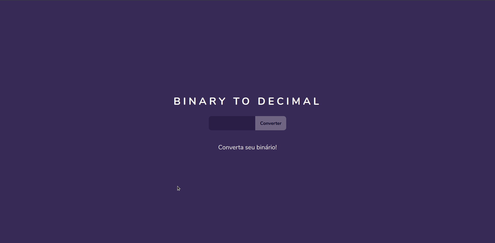

# binarytodecimal

This project is a resolution of [this beginner project](https://github.com/florinpop17/app-ideas/blob/master/Projects/1-Beginner/Bin2Dec-App.md) of [App Ideas](https://github.com/florinpop17/app-ideas) repository.

My goal with this project was to practice my JS skills.
So a figured out a not so conventional way to convert a binary to a decimal number using JavaScript iterator protocol.

Check my code out and feel free to make suggestions or improvements.

Also check live demo [here](https://raphaelcdsouza.github.io/binarytodecimal/).

made with 💜 by Raphael